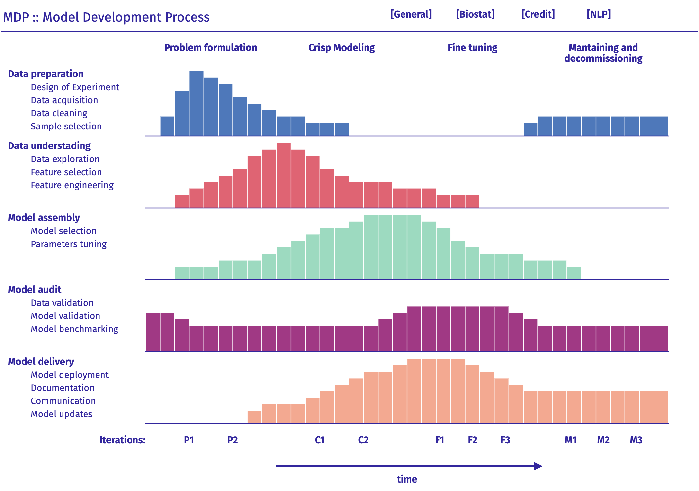
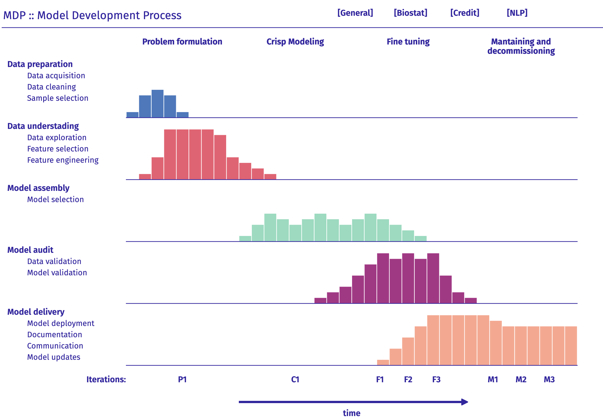
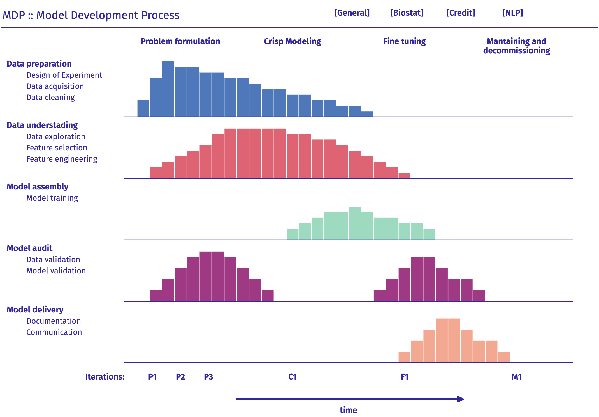
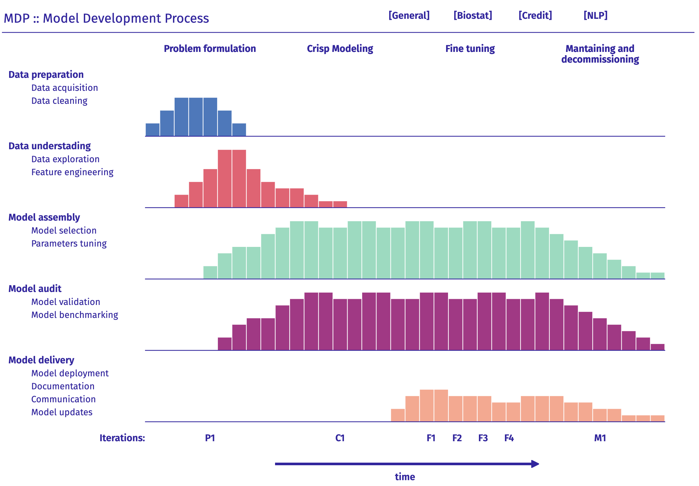

# ModelDevelopmentProcess

Source codes for Model Development Process plots

An interactive example:
https://modeloriented.github.io/ModelDevelopmentProcess/

More about MDP profiles: https://arxiv.org/abs/1907.04461

## MDP in general

Process definition [inst/processes/0general.txt](inst/processes/0general.txt)

## MDP in credit scoring

Process definition [inst/processes/credit.txt](inst/processes/credit.txt)

## MDP in biostatistics

Process definition [inst/processes/biostat.txt](inst/processes/biostat.txt)

## MDP in NLP deep learning

Process definition [inst/processes/deep.txt](inst/processes/deep.txt)

